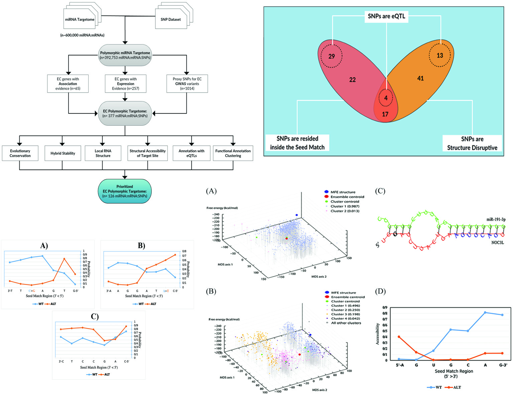

## Milad Bastami's Research Portfolio

- PhD Medical Genetics (Computational Biology)
- Experienced in applications of Computational Biology and Bioinformatics in Genomics Medicine

### Contact details and profiles

- **email**: mi.bastami@live.com
- [linkedin](https://www.linkedin.com/in/milad-bastami/)
- [ResearchGate](https://www.researchgate.net/profile/Milad-Bastami-2)
- [Publons](https://publons.com/researcher/1428182/milad-bastami/)
- [Google Scholar](https://scholar.google.com/citations?user=qzfFHyUAAAAJ&hl=en)
- [Scopus](https://www.scopus.com/authid/detail.uri?authorId=55643811800)
- [ORCiD](https://orcid.org/0000-0002-7686-4505)

### About Me

I am a genomics scientist with a great enthusiasm for the applications of Computational Biology (CB) and Machine Learning. I have 5 years of total experience, with 4 years working as a postdoctoral assistant professor and one year as a genomics scientist.  
I've been intrigued by CB since early days of my PhD career, when I integrated dry lab and wet lab approaches to perform a genome-wide scan for regulatory genomic variants affecting noncoding RNA network in cardiovascular diseases and cancer. After completing the degree, I eagerly moved toward CB by pursuing an autodidactic hands-on career and realized that having experience in both experimental and computational biology provides a great perspective and capacity to effectively collaborate with scientists from broad disciplines.

Throughout my career, I have been actively pursuing self-training in statistics (basic, meta-analysis, and machine learning), bioinformatics, coding and data visualization in R/Bioconductor and Python, and version control system and gained invaluable experience in retrieving, analyzing, and integrating omics data into bioinformatics workflows.

### Research Interests

- Using integrative genomics to infer relationships between genome elements, biological functions and disease phenotypes
- Disease genomics: using large-scale genomics data and association studies to characterize and validate causative gene/variants in complex disorders
- Explore the application of machine learning in genomic medicine

### Work Experience

- **Genomics Scientist** at Motahari Medical Laboratory
  - Setting up and running genomic sequencing analysis workflows
  - Identifying and interpreting disease variants in inherited disorders
  - Training and mentoring staff and scientists
- __Postdoctoral Assistant Professor__ at [Tabriz University of Medical Sciences](https://www.linkedin.com/school/tabriz-university-of-medical-sciences/)
  - Department of Medical Genetics, Faculty of Medicine, Tabriz University of Medical Sciences, Tabriz, Iran
  - **Major duties:** conducting research, mentoring projects, giving lectures in postgraduate courses.
  - __Research activities:__
    - Conducting interdisciplinary research in collaboration with other departments (e.g. physics, biotechnology, molecular medicine, biochemistry) and international institutions.
    - Directly supervising/advising: 5 MSc and 4 PhD project
    - Providing students and staff with scientific consultations on designing and conducting experiments, retrieving and analyzing biomedical data, statistical analysis, interpreting and visualizing data, troubleshooting protocols, and molecular procedures.
    - Actively pursuing self-learning and hands-on experience in bioinformatics, statistics (e.g. meta-analysis, machine learning), R, bash and Unix tools, and getting acquainted with Git version control system and SQL. Held workshop on using R.
  - __Research focus:__
    - Genomics of complex disorders: deciphering the role of regulatory genomic variants and polymorphisms using GWAS data and bioinformatics approach (non-coding RNAs, and microRNAs).
    - Leveraging bioinformatics, integrative genomics, and statistical approaches to connect genomics to medicine and prioritize functional genomic variants conferring susceptibility to diseases.
    - Identifying and prioritizing crucial molecular components of complex disorders that may have potential applications in genomics medicine
    - Using available omics data to narrow down and interpret findings of genome-wide association studies in complex disorders
  - __Other responsibilities:__
    - Deputy Head of Department for Research
    - A member of the Research Council for Postgraduate Studies
    - A member of the Research Ethics Committee of Tabriz University of Medical Sciences.
    - The scientific advisor of exceptional talent students at Tabriz University of Medical Sciences.

### Projects and Publications

#### Bioinformatics approaches in complex disorders
We designed bioinformatics workflows to carry out genome-wide scans for disease-associated variants that influence noncoding RNA network in complex disorders. Specifically, we were interested in the identification, functional annotation and prioritization of genetic variations in microRNA targetome of cardiovascular diseases and cancers. We integrated data from various sources (e.g.GWAS , other association studies, expression studies, 1000 genomes project, dbSNP) and perform several bioinformatics analysis to characterize polymorphisms disrupting miRNA target sites and provided deep insights into the way each polymorphism may affect miRNA:mRNA interaction. We analyzed the effect of polymorphisms on structural ensemble of 3'-UTRs, local RNA structure, RNA accessibility, and hybrid stability.The findings helped to characterize and prioritize disease-associated variants in microRNA network of complex disorders.

